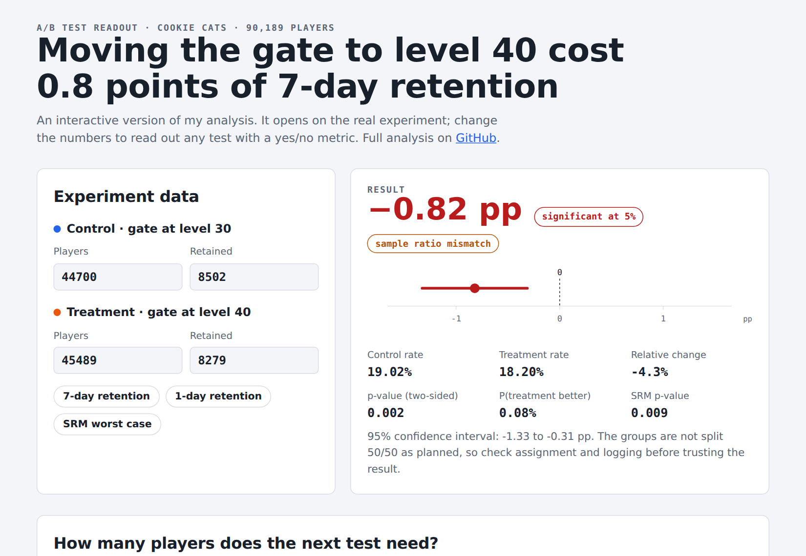
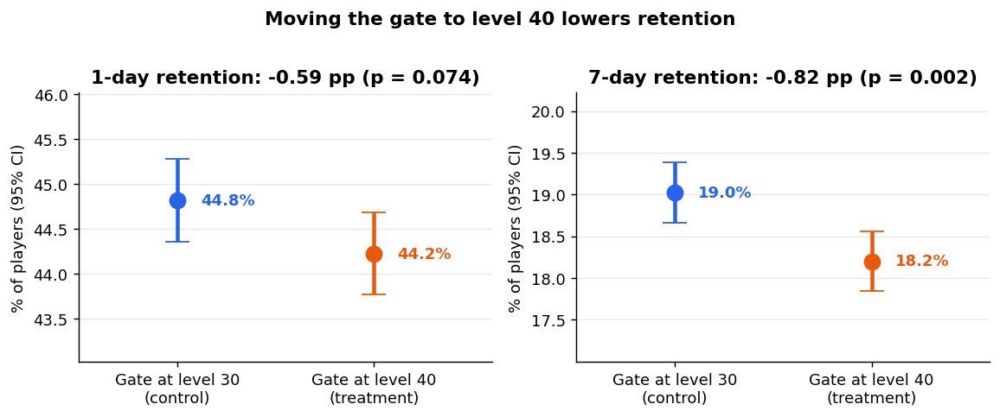
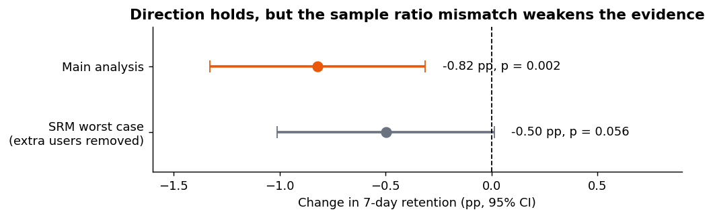
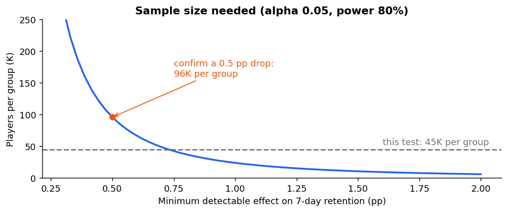

# 🎮 Cookie Cats A/B Test — Should the first gate move from level 30 to level 40?

> **Moving the gate to level 40 lowered 7-day retention by 0.82 points (19.0% → 18.2%, p = 0.002).**
> I also found a **sample ratio mismatch** in the experiment that most analyses of this dataset miss, measured how much it
> could bias the result, and turned it all into a decision and a plan for the next test.

**Tools:** Python (pandas, SciPy, statsmodels) · SQL (DuckDB) · pytest · matplotlib · JavaScript

**▶ [Interactive readout & sample size calculator](https://robertobustamanteperez25-star.github.io/cookie-cats-ab-test/)**



---

## 📌 The question
In the mobile puzzle game *Cookie Cats*, players reach a **gate** where they must wait or pay to keep playing.
90,189 new players were randomly assigned to the gate at **level 30 (control)** or **level 40 (treatment)**.
Should the game ship gate 40?

| Metric | Role | Gate 30 | Gate 40 | Change | p-value |
|---|---|---|---|---|---|
| 7-day retention | **Primary** | 19.02% | 18.20% | **−0.82 pp (−4.3%)** | **0.002** (Holm-adjusted 0.003) |
| 1-day retention | Secondary | 44.82% | 44.23% | −0.59 pp | 0.074 |
| Rounds played (winsorised) | Guardrail | — | — | −0.1 rounds, 95% CI [−1.3, +1.2] | n.s. |



## 🔎 What I found
1. **Gate 40 hurts long-term retention.** The 95% CI for the 7-day change is [−1.33, −0.31] pp and stays significant after
   correcting for two metrics. In Bayesian terms, P(gate 40 is better) = **0.08%**.
2. **The experiment has a sample ratio mismatch.** Gate 40 received 789 more players than a 50/50 split allows
   (χ² p = 0.009). The excess sits almost entirely in players who **never reached level 30** and so never saw either gate,
   which points to an assignment or logging problem rather than a real effect.
3. **The conclusion survives the SRM, with less certainty.** If those extra players are removed in the worst possible way,
   the effect shrinks to −0.50 pp (p = 0.056): still negative, no longer significant.



## 💡 Recommendation
- **Keep the gate at level 30.** Every analysis points the same way and the risk is one-sided: about 8 fewer players
  still active after a week per 1,000 installs with gate 40, and no gain in engagement.
- **Fix the assignment bug before the next experiment**: check bot traffic, duplicate installs and event logging in the
  gate_40 bucket, and add an automatic SRM alert on day 1.
- **If product still wants gate 40**, run a confirmation test sized for a 0.5 pp effect: **≈ 96K players per group**
  (this test had 45K, enough only for effects ≥ 0.74 pp).



## 🧠 Methodology
- **Health checks first:** unique users, missing values, SRM (chi-square), outliers (one player with 49,854 rounds).
- **Frequentist:** two-proportion z-tests with Wald CIs; **Holm-Bonferroni** correction across the two retention metrics.
- **Bayesian:** Beta(1,1) priors → posterior P(better) and expected loss of each decision.
- **Guardrail:** rounds played is heavy-tailed, so I winsorise at the 99.9th percentile and use a **bootstrap** CI.
- **Sensitivity analysis:** worst-case removal of the SRM excess.
- **Design:** minimum detectable effect of this test and sample size for a follow-up.
- **Tested code:** the statistics live in [`src/abtest.py`](src/abtest.py) with 8 unit tests that check them against statsmodels.
- **SQL:** the same metrics and z-test computed in DuckDB in [`sql/metrics.sql`](sql/metrics.sql).

## 🗂️ Repository structure
```
├── get_data.py              # downloads cookie_cats.csv into data/raw/
├── src/abtest.py            # SRM, z-test, Holm, bootstrap, Bayesian, sample size, MDE
├── tests/test_abtest.py     # pytest suite (validated against statsmodels)
├── analysis.py              # runs everything -> images/ and results/results.json
├── sql/metrics.sql          # metrics and z-test in DuckDB
├── notebooks/ab_test.ipynb  # narrative analysis
└── docs/index.html          # interactive readout + sample size calculator (GitHub Pages)
```

## ▶️ How to run
```bash
pip install -r requirements.txt
python get_data.py
pytest -q                 # 8 passed
python analysis.py        # charts + results/results.json
duckdb < sql/metrics.sql
```

## 📚 Data & limitations
Cookie Cats A/B test data (Tactile Entertainment, published for teaching by DataCamp): one row per player with variant,
rounds played in the first 14 days and 1-day / 7-day retention. No timestamps (novelty effects and peeking cannot be
checked) and no revenue (gates also drive in-app purchases), so the recommendation is about retention only.

---
**Roberto Bustamante Pérez** · Data Science student (UOC) · Palma de Mallorca, Spain ·
[LinkedIn](https://www.linkedin.com/in/roberto-bustamante-perez/) · [GitHub](https://github.com/robertobustamanteperez25-star)
